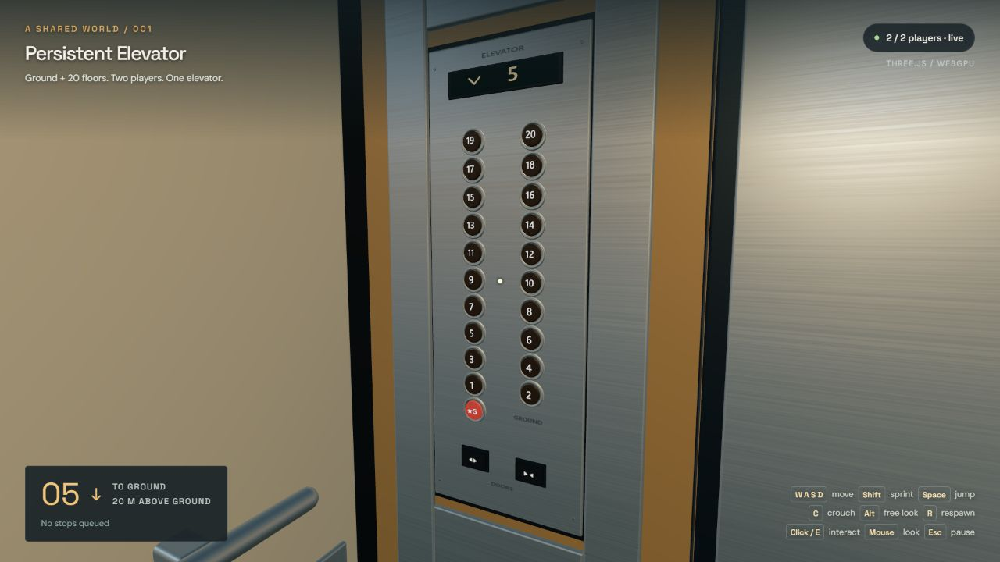

# Persistent Elevator Example



A small multiplayer game demonstrating a server-authoritative elevator with **Vite, TypeScript, Three.js, and SpacetimeDB**. Two anonymous players share one elevator, its doors, and its destination queue. Both players can walk around the moving cab, select **G or any floor 1–20** by clicking or pressing E, leave onto a landing, and jump off the platform. A real ground stop lets a fallen player call the elevator and board again from the plaza.

Players are capsules. The first-person mouse-look implementation is copied from Mammoth's production controller: native pointer lock, unrestricted yaw, immediate camera rotation, the same sensitivity/pitch/coast, and Alt free-look/recentering. Movement follows the body/camera heading. This repository has no Mammoth runtime, asset, or authentication dependencies. Jumping inside the cab is an intentional extension to Mammoth's current controls.

Three.js `WebGPURenderer` uses native WebGPU when available and its WebGL2 fallback otherwise. The HUD displays the active backend. Use `?backend=webgl` to exercise the fallback, or `?debug=1` to show collision wireframes.

## Run locally

Requirements: **Node.js 22.12 or newer**, npm, and the **SpacetimeDB 2.10.2 CLI**. The JavaScript SDK and server module also use SpacetimeDB 2.10.2. Install the CLI using the [SpacetimeDB installer](https://spacetimedb.com/install).

From this repository:

```sh
npm install
npm install --prefix spacetimedb
```

Start the database in a terminal and leave it running:

```sh
npm run db:start
```

This starts a local database on `127.0.0.1:3001`, with durable data in `.spacetime-data/`. In a second terminal:

```sh
npm run db:publish
npm run db:generate
npm run dev
```

Open [http://localhost:5174](http://localhost:5174). The default connection settings match these commands. To change them, copy `.env.example` to `.env.local`, edit `VITE_SPACETIMEDB_URI` and `VITE_SPACETIMEDB_DATABASE`, and restart Vite.

The CLI wrapper also checks the usual Windows installation directory. If your CLI is elsewhere and unavailable on `PATH`, set the `SPACETIME_BIN` environment variable to the executable's full path.

## Try two players

1. Open the game in two browser tabs. Each tab connects as an anonymous guest, with its own token stored in `sessionStorage`. If **Duplicate tab** copies the first token, the client detects the occupied identity and obtains a separate guest token.
2. Click **Enter** to capture the mouse. Move it freely to turn in either direction, aim the center reticle at a numbered button, and **click or press E**. The first click captures the mouse; subsequent clicks interact. A gold reticle and highlighted control show the target. If an embedded preview blocks capture, the game stays paused and offers a desktop-browser link and URL copy button. Open the URL in Chrome, Edge, or Firefox for native mouse capture.
3. Ride together, or leave one player on a platform and call the elevator from that landing. Both players see the same cab, queue, and gates.
4. Aim at the landing gate and click or press **E** when the cab is docked, then walk out. After falling onto the plaza, walk to the **G** call station beside the shaft, call the cab, open the docked gate, and board again. **R** also respawns.
5. Reload a tab to reconnect with that tab's identity. Stop and restart the database using the same `.spacetime-data/` directory to inspect persistence.

The instance allows **two connected players**. A third guest remains in the lobby and can retry when a place becomes available. Closed tabs leave offline guest rows; a fresh tab may replace an offline guest, retaining its pose, to keep this small demo bounded. A tab's token lasts for its browser session, so there is no account or permanent player identity to restore later.

## Controls

| Input | Action |
| --- | --- |
| WASD | Walk |
| Left or right Shift | Sprint |
| C | Toggle crouch |
| Space | Jump; hold for the full jump height |
| Mouse | Look |
| Hold Alt + mouse | Free look while keeping movement heading |
| Left click | Capture/resume the mouse; while captured, operate the aimed control |
| E | Operate the aimed floor, call, cabin-door or landing-gate control |
| R | Respawn |
| Escape | Pause movement and release mouse |

The numbered floors **1–20** are spaced 4 meters apart. **G** is a twenty-first stop at plaza level, height −4; floor 1 and the cab start at height 0. Each upper landing is a platform in front of the shaft. The landing gates open only when the cab is docked and close when it leaves. The interior doors close before travel and open at arrival.

The compact stainless-steel control station sits beside the doors, with two columns of small illuminated buttons, a starred G, and door controls. A digital indicator above the doorway and another on the station show the nearest floor as the cab travels, with an up/down arrow. Their reading follows the rendered height rather than staying at the departure floor until arrival.

[View the compact panel](docs/panel.jpg).

## The multiplayer implementation

There are three database tables: players, the shared elevator, and the scheduled simulation tick. Clients send movement input and interaction requests through reducers. They never submit authoritative positions or advance the elevator themselves.

`shared/simulation.ts` contains the pure movement, collision, elevator, and rider-support rules used by both server simulation and client prediction. The server persists state; clients predict their own movement and render replicated players and elevator motion smoothly. `src/motion.ts` presents motion on a buffered server timeline and places riders/cameras in the rendered cab's exact moving frame. Repeated input/queue updates do not restart the trajectory. `src/floor-indicator.ts` provides the shared physical-panel/HUD reading. A server restart skips the elapsed outage instead of simulating a large backlog of physics steps.

Existing worlds upgrade without a database reset. Floors 1–20 keep their original landing-door indexes; G appends index 20 to the arrays. The module extends old arrays without changing saved cab/player positions, floor numbers, or queued stops.

This is a deliberately small, trusted anonymous demo. SpacetimeDB supplies connection identities without an account login. The module bounds inputs, limits player slots, and guards its scheduled tick; it does not demonstrate account authentication, access permissions, or a production anti-cheat system.

Read [the architecture notes](docs/architecture.md) for the data flow, persistence behavior, and moving-platform rules.

Read [the validation record](docs/validation.md) for the checks performed and visual inspection inputs.

## Development checks

```sh
npm test
npm run build
npm run test:multiplayer
```

`npm test` exercises the shared simulation. `npm run build` checks TypeScript and creates the Vite production build. The multiplayer check requires the local database to be running with the module published, and exercises real SDK connections. Run it against a disposable local demo instance with both player slots free.

After changing the server schema or reducer signatures, run `npm run db:generate` and `npm run db:publish`. Generated TypeScript bindings live in `src/module_bindings/`.

## License

[MIT](LICENSE), copyright SeloSlav.
