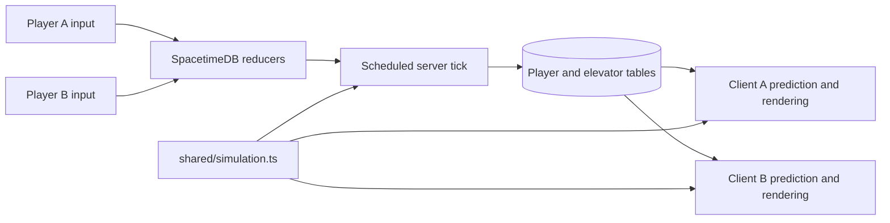

# How the elevator stays shared

The example has one persistent world with two connected player slots. SpacetimeDB owns the elevator state, landing gates, and player simulation. Three.js renders those rows and predicts the local player's movement so controls respond immediately.

## Small database surface

| State | Purpose |
| --- | --- |
| Player rows | Anonymous identity, connected state, input, and authoritative movement state |
| One elevator row | Cab motion, current destination, shared stop queue, interior doors, and landing gates |
| Scheduled tick row | Drives authoritative simulation independently of browser render loops |

Movement reducers accept bounded input and view heading, rather than a client-provided position. Interaction reducers request a floor, hail the cab, toggle a landing gate, or respawn. The server validates requests against its player and elevator state. Clients cannot use an ordinary reducer call to invoke the scheduled simulation tick: that reducer checks its sender.

All clients subscribe to the same state. When either player presses a floor button, both receive the updated shared queue. The server then closes the interior doors, moves the cab, docks, and opens the doors. Landing gates are distinct from the automatic interior doors: a player opens the docked landing gate using E, and it closes when the cab departs.

## Moving platforms and prediction

`shared/simulation.ts` is independent of Three.js and SpacetimeDB. Both runtimes use it for the movement and elevator rules. That keeps speeds, gravity, collision bounds, door rules, and platform support aligned without copying the game simulation into a separate client implementation.

The cab advances before player movement. A rider supported by the cab follows its change in height, while retaining movement across the cab floor. Support tests use horizontal bounds and vertical proximity, so a player on a landing above the cab does not attach to the cab below. The doorway bridges cab and landing support while docked. Closed doors and gates constrain passage.

The local client predicts movement from the same inputs it submits to the server and reconciles with authoritative snapshots. Remote capsules use replicated state for presentation. Elevator rendering evaluates its motion between updates; its floor, its doors, and its riders use the same evaluated cab height. Render frame rate does not determine shared elevator progress.

The example keeps Mammoth's WASD, Shift sprint, C crouch toggle, Space jump, Alt free look, mouse look, and V camera controls. E operates the aimed floor, call, and door controls, and the nearby landing gate. Speeds are 5 m/s walking, 7.5 m/s sprinting, and 2.8 m/s crouching. Gravity is 21.5 m/s², with a 5.7 m/s jump impulse. Pill bodies have a .22 m radius and standing/crouched heights of 1.78/1.2 m. Jumping inside the cab is allowed here as an intentional extension to Mammoth.

Mouse movement turns the camera without holding a button. Native pointer lock allows continuous rotation; the embedded-browser fallback follows movement within the viewport. Third-person orbit uses both pitch and yaw, constrained to the cab while inside it. Escape, focus loss, and a hidden document clear held movement and submit neutral input immediately. Interaction raycasts use the center reticle and respect opaque surfaces.

## Anonymous players and reconnects

There is no account signup or login. The SDK obtains an anonymous connection identity and token. The client stores the token in `sessionStorage`, so a normal reload of that tab reconnects with its existing identity. Independently opened tabs use separate guest sessions. If a duplicated tab inherits the first guest token, the server rejects that simultaneous seat claim and the second client reconnects with a new anonymous identity.

Only two guests can be connected at once. A third guest waits in the lobby and can retry. Disconnecting marks a player offline instead of immediately erasing its state. A new guest can replace an offline guest row to keep the example limited to two player slots. The original tab can restore its state only while its row and token still exist; this is not permanent account-backed identity.

Inputs expire after 300 ms without a packet. A separate 100 ms heartbeat runs independently of rendering. An abandoned seat expires after 10 seconds without input. Door safety considers online capsules only, so a retained offline pose cannot obstruct the elevator indefinitely.

## What persists

SpacetimeDB stores the elevator and player rows in the database directory. `.spacetime-data/` is ignored by Git. Keep that directory when restarting the local server to preserve the cab, destination queue, gates, and guest state. Removing it creates a fresh world. Reusing a tab's token alone cannot restore a player that no longer exists in the database.

The server's scheduled tick continues to own progress while browsers are absent. After a server outage, elapsed time is not replayed as a huge physics step or a backlog of missed ticks. The simulation resumes from its durable state with a bounded step. This makes database persistence easy to observe without forcing players through an accelerated catch-up simulation.

Republishing the module and regenerating bindings are development operations. For a clean persistence experiment, stop and restart the same server without deleting its data directory or resetting the database.

## Scope

This repository is an isolated multiplayer example with one elevator and two guest slots. The player cap, input bounds, interaction checks, input timeout, and scheduled-tick guard make the core authority clear. Anonymous identities are not a substitute for production account security or a complete anti-cheat system.

The world is generated from code: 20 floors, four meters apart, with simple landing platforms and a ground plaza. It does not import Mammoth assets or services. The graphics path is Three.js `WebGPURenderer`, with a WebGL2 fallback for machines without native WebGPU; the active backend is shown in the HUD.
