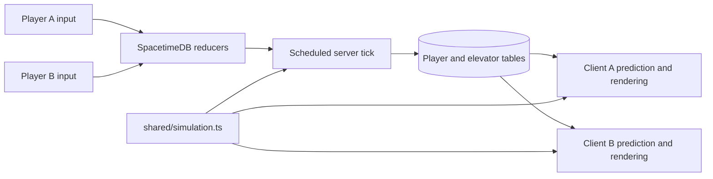

# How the elevator stays shared

The example has one persistent world with two connected player slots. SpacetimeDB owns the elevator state, landing gates, and player simulation. Three.js renders those rows and predicts the local player's movement so controls respond immediately.

## Small database surface

| State | Purpose |
| --- | --- |
| Player rows | Anonymous identity, connected state, input, and authoritative movement state |
| One elevator row | Cab motion, current destination, shared stop queue, interior doors, and landing gates |
| Scheduled tick row | Drives authoritative simulation independently of browser render loops |

Movement reducers accept bounded input and view heading, rather than a client-provided position. Interaction reducers request a floor, hail the cab, toggle a landing gate, or respawn. The server validates requests against its player and elevator state. Clients cannot use an ordinary reducer call to invoke the scheduled simulation tick: that reducer checks its sender.

All clients subscribe to the same state. When either player presses a floor button, both receive the updated shared queue. The server then closes the interior doors, moves the cab, docks, and opens the doors. Landing gates are distinct from the automatic interior doors: a player opens the docked landing gate using E, and it closes when the cab departs.

Stops are **G (floor 0, y = −4)** and numbered floors **1–20 (y = 0–76)**. G is served by the same queue and reducer paths, with a plaza call station and a manual gate. A fallen player can walk to that station, hail G, open its gate once docked, and reenter the cab. Zero-valued requests are handled explicitly and remain in the FIFO queue.

The table schema is unchanged. `landingIndex` retains floor-minus-one for floors 1–20 and maps G to appended index 20. `normalizeLandingState` extends legacy twenty-entry arrays at the database/client boundaries without shifting indexes, resetting positions, or changing the active trip. The scheduled simulation uses the inverse `landingFloor` mapping for gate animation.

## Moving platforms and prediction

`shared/simulation.ts` is independent of Three.js and SpacetimeDB. Both runtimes use it for the movement and elevator rules. That keeps speeds, gravity, collision bounds, door rules, and platform support aligned without copying the game simulation into a separate client implementation.

The cab advances before player movement. A rider supported by the cab follows its change in height, while retaining movement across the cab floor. Support tests use horizontal bounds and vertical proximity, so a player on a landing above the cab does not attach to the cab below. The doorway bridges cab and landing support while docked. Closed doors and gates constrain passage.

The local client predicts movement from the same inputs it submits to the server and reconciles with authoritative snapshots. Remote capsules use replicated state for presentation. Elevator rendering buffers 100 milliseconds of server-timestamped samples, interpolates with bounded cubic tangents, and extrapolates at most 100 milliseconds. Duplicate-timestamp input/queue updates replace metadata without restarting the presentation clock. An ascending or descending journey never corrects backwards when a late packet arrives.

Prediction and presentation have separate elevator states. Grounded riders and the first-person camera use the rendered cabin height on every render frame, even between physics ticks; jumping riders retain their predicted height relative to the simulation cab. Horizontal movement stays immediate. The cab, doors, grounded remote riders and camera therefore share one moving frame. Render frame rate does not determine shared elevator progress.

`floorIndicator` derives the current displayed floor from rendered height, switching at the midpoint between landings. It clamps to G–20 and derives the travel arrow from destination and phase. This drives both the physical LED displays and HUD. The authoritative `currentFloor` continues to identify the last docked stop, so display updates do not change docking, gate checks, or network authority.

The example keeps Mammoth's WASD, Shift sprint, C crouch toggle, Space jump, Alt free look, and first-person mouse look. Locked left-click and E operate the aimed floor, call, and door controls. Speeds are 5 m/s walking, 7.5 m/s sprinting, and 2.8 m/s crouching. Gravity is 21.5 m/s², with a 5.7 m/s jump impulse. Pill bodies have a .22 m radius and standing/crouched heights of 1.78/1.2 m. Jumping inside the cab is allowed here as an intentional extension to Mammoth.

`src/fp-look.ts` copies Mammoth's pure production look calculations. Native pointer-lock deltas update camera rotation immediately, with the same .0022 radians-per-pixel sensitivity, 1.53-radian pitch limit, light post-flick coast and Alt recenter. Horizontal turning is unlimited and drives the same heading submitted for movement. Alt alone temporarily separates head yaw from body yaw. There is no third-person orbit or viewport-limited substitute. Capture failure remains paused. Escape, focus loss, and a hidden document clear transient movement and submit neutral input. A delayed capture request cannot resume paused play. Click and E refresh the center ray and respect opaque surfaces; decorative geometry is only tested for occlusion when interacting.

There is no welcome or pause modal. Losing focus releases the mouse while preserving the first-person camera and unobstructed scene. A click in the canvas reacquires native capture; a small controls hint explains this when unlocked. Connection/capture errors, browser links and the two-seat retry action stay in the corner HUD.

## Anonymous players and reconnects

There is no account signup or login. The SDK obtains an anonymous connection identity and token. The client stores the token in `sessionStorage`, so a normal reload of that tab reconnects with its existing identity. Independently opened tabs use separate guest sessions. If a duplicated tab inherits the first guest token, the server rejects that simultaneous seat claim and the second client reconnects with a new anonymous identity.

Only two guests can be connected at once. A third guest waits in the lobby and can retry. Disconnecting marks a player offline instead of immediately erasing its state. A new guest can replace an offline guest row to keep the example limited to two player slots. The original tab can restore its state only while its row and token still exist; this is not permanent account-backed identity.

Inputs expire after 300 ms without a packet. A separate 50 ms heartbeat runs independently of rendering. An abandoned seat expires after 10 seconds without input. Door safety considers online capsules only, so a retained offline pose cannot obstruct the elevator indefinitely.

## What persists

SpacetimeDB stores the elevator and player rows in the database directory. `.spacetime-data/` is ignored by Git. Keep that directory when restarting the local server to preserve the cab, destination queue, gates, and guest state. Removing it creates a fresh world. Reusing a tab's token alone cannot restore a player that no longer exists in the database.

The server's scheduled tick continues to own progress while browsers are absent. After a server outage, elapsed time is not replayed as a huge physics step or a backlog of missed ticks. The simulation resumes from its durable state with a bounded step. This makes database persistence easy to observe without forcing players through an accelerated catch-up simulation.

Republishing the module and regenerating bindings are development operations. For a clean persistence experiment, stop and restart the same server without deleting its data directory or resetting the database.

## Scope

This repository is an isolated multiplayer example with one elevator and two guest slots. The player cap, input bounds, interaction checks, input timeout, and scheduled-tick guard make the core authority clear. Anonymous identities are not a substitute for production account security or a complete anti-cheat system.

The world is generated from code: 20 upper floors, four meters apart, with landing platforms and a ground plaza served by G. The narrow control station beside the doors retains physical button picking and immediate queue feedback. Ground rendering has a cab footprint cutout so plaza and cab floor do not render coincident surfaces when docked at G. The world does not import Mammoth assets or services. The graphics path is Three.js `WebGPURenderer`, with a WebGL2 fallback for machines without native WebGPU; the active backend is shown in the HUD.
